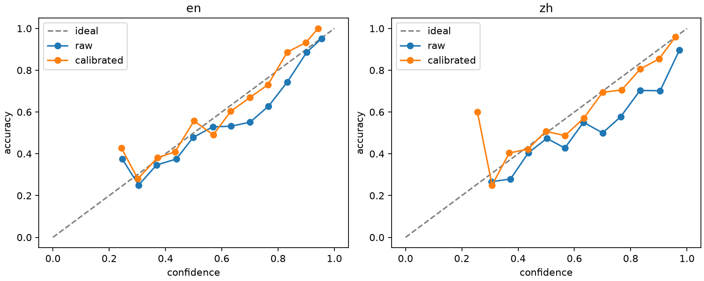
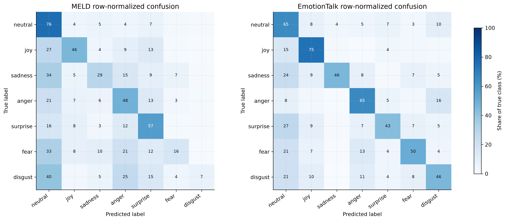

# BIMER confirmatory results

This report contains public aggregate evidence only. Per-utterance predictions,
features, checkpoints and restricted media remain in the private evidence
archive.

## Protocol

- Official MELD and EmotionTalk train/validation/test splits are preserved.
- EmotionTalk context grouping reconstructs 742 full conversations without
  changing `sample_id`.
- All formal variants use the same frozen features and joint bilingual training
  protocol.
- Results are reported over seeds 42, 123 and 2026.
- `±` is the sample standard deviation (`ddof=1`).
- Model differences use 2,000 paired cluster-bootstrap iterations over complete
  `context_id` groups.
- Test results were not used to change V2 architecture or hyperparameters.

## Data audit

| Dataset | Train | Validation | Test | Contexts |
|---|---:|---:|---:|---:|
| MELD | 9,989 | 1,109 | 2,610 | 1,432 |
| EmotionTalk | 15,413 | 1,908 | 1,929 | 742 |
| Total | 25,402 | 3,017 | 4,539 | 2,174 |

All 32,958 utterances have unique sample IDs and resolvable feature records.
There are no missing or orphaned cached features and no duplicate
`context_id + utterance_id` keys.

## Corrected single-modality baselines

The pre-audit audio run had collapsed to the majority class and is excluded
from the formal comparison. The corrected protocol fits per-dimension input
normalization on the training split, reshuffles deterministically every epoch,
enforces at least 15 epochs before patience is counted, and selects learning
rates with seed 42 on the official validation split. The selected configuration
was frozen before these three-seed test evaluations.

| Modality | Dataset | learning rate | weighted-F1 | macro-F1 | accuracy |
|---|---|---:|---:|---:|---:|
| Text | MELD | 3e-4 | **59.819% ± 0.378%** | 40.728% ± 0.899% | 60.434% ± 0.632% |
| Text | EmotionTalk | 3e-4 | 44.049% ± 0.438% | 38.955% ± 0.155% | 43.563% ± 0.441% |
| Audio | MELD | 3e-4 | 44.473% ± 0.785% | 25.952% ± 0.885% | 46.284% ± 1.053% |
| Audio | EmotionTalk | 1e-3 | **52.046% ± 1.454%** | 41.620% ± 1.521% | 52.532% ± 2.025% |
| Vision | MELD | 1e-3 | 35.882% ± 0.520% | 16.815% ± 0.979% | 41.392% ± 1.605% |
| Vision | EmotionTalk | 1e-3 | 44.224% ± 3.696% | 33.587% ± 2.319% | 44.548% ± 2.979% |

All 18 formal runs predicted all seven classes. In particular, corrected audio
weighted-F1 exceeds the majority baseline by 13.204 points on MELD and 27.679
points on EmotionTalk, confirming that the frozen XLS-R features were useful
and that the earlier failure came from optimization rather than absent acoustic
signal. The frozen selection record is
[`configs/experiment-v2-unimodal-selection.json`](configs/experiment-v2-unimodal-selection.json);
the public aggregate table is
[`results/v2_unimodal_corrected_summary.csv`](results/v2_unimodal_corrected_summary.csv).

## Main results

| Model | MELD weighted-F1 | EmotionTalk weighted-F1 | Bilingual average |
|---|---:|---:|---:|
| Early MLP | 58.113 ± 0.051 | 59.197 ± 0.414 | 58.655 ± 0.189 |
| Early Context | 58.118 ± 1.466 | 61.095 ± 1.286 | 59.607 ± 1.233 |
| No-gate Context | 58.582 ± 0.461 | 61.535 ± 2.006 | 60.059 ± 1.071 |
| V2 Quality LAGF | **58.620 ± 0.830** | **61.675 ± 1.423** | **60.148 ± 1.124** |

V2 exceeds Early MLP by 1.493 percentage points on the bilingual average
(95% CI 0.669 to 2.200). Its 0.089-point clean-set advantage over the no-gate
context baseline is not statistically established (95% CI -0.603 to 0.791).

## Ablation

Positive deltas mean the complete model performs better than the ablated model.

| Removed component | Bilingual weighted-F1 | Complete-model delta | 95% CI | Evidence |
|---|---:|---:|---:|---|
| Language embedding | 60.230 ± 0.515 | -0.082 | [-0.756, 0.538] | unsupported |
| Reliability gates | 60.163 ± 0.134 | -0.015 | [-0.738, 0.669] | unsupported on clean test |
| Dialogue context | 58.763 ± 0.432 | **+1.385** | **[0.549, 2.157]** | supported |
| Quality input | 60.114 ± 1.197 | +0.034 | [-0.044, 0.113] | unsupported overall |
| Modality dropout | 59.399 ± 0.868 | **+0.749** | **[0.019, 1.445]** | supported |
| Corruption training | 59.652 ± 2.292 | +0.496 | [-0.213, 1.172] | directional only |

The thesis therefore claims context modeling and modality dropout as supported
contributions. It describes quality gating as a targeted robustness mechanism,
not as a universal clean-set improvement. Language embedding remains an
implemented but unsupported component.

## Robustness

V2 Quality LAGF bilingual weighted-F1:

| Condition | weighted-F1 | Change from clean |
|---|---:|---:|
| Clean | 60.148 | — |
| Audio 20 dB SNR | 58.904 | -1.244 |
| Audio 10 dB SNR | 58.080 | -2.068 |
| Video frame drop 25% | 58.709 | -1.439 |
| Video frame drop 50% | 58.514 | -1.634 |
| Whisper text | 55.760 | -4.388 |
| Missing audio | 56.637 | -3.511 |
| Missing vision | 57.463 | -2.685 |
| Missing text | 47.376 | -12.772 |

Compared with the no-gate contextual baseline, V2 gains 0.986 points at 25%
video frame drop (95% CI 0.239 to 1.705) and 0.729 points at 50% frame drop
(95% CI -0.044 to 1.483). Its loss at 50% frame drop is smaller than its loss
when vision is fully missing. However, the no-gate model is stronger under the
tested 10 dB audio corruption. This mixed evidence is why the claim is limited
to targeted video-degradation robustness.

Whisper text produces the largest non-missing-modality loss, especially on
MELD, and is a central practical limitation of the end-to-end system.

## Confidence calibration

Temperature scaling was fitted separately for English and Chinese using only
the official validation splits and the frozen V2 seed-42 checkpoint. Both
languages passed the predeclared rule: ECE had to fall by at least 10% and NLL
could not worsen. Temperature scaling preserves the predicted class and
therefore does not change accuracy or F1.

| Language | Temperature | Uncertainty threshold | ECE before | ECE after | NLL before | NLL after |
|---|---:|---:|---:|---:|---:|---:|
| English | 1.193 | 0.45 | 6.548% | **3.923%** | 1.1813 | **1.1653** |
| Chinese | 1.391 | 0.55 | 11.728% | **3.514%** | 0.9367 | **0.8822** |

English and Chinese Brier scores also improved from 0.5593 to 0.5522 and from
0.4728 to 0.4523, respectively. The deployed system uses the calibrated
probabilities and marks utterances below the language-specific threshold as
uncertain. Machine-readable values are in
[`results/v2_calibration_summary.csv`](results/v2_calibration_summary.csv).

## Rare classes

The V2 per-class F1 values show a large dataset gap:

- MELD `fear`: 13.632%; `disgust`: 9.272%.
- EmotionTalk `fear`: 48.595%; `disgust`: 35.194%.

Consequently, weighted-F1 must be reported together with macro-F1, per-class F1
and confusion matrices. A high neutral-class score is not evidence of balanced
recognition.

The row-normalized three-seed confusion matrices make the imbalance concrete:
MELD `fear` and `disgust` are frequently absorbed into higher-support classes,
while EmotionTalk retains substantially stronger diagonal mass for both.
Machine-readable cells are in
[`results/v2_confusion_matrix.csv`](results/v2_confusion_matrix.csv).

## Strict cross-language transfer

The earlier single-language LAGF checkpoints were also evaluated without
target-language fine-tuning:

| Training data | Test data | Evaluation | weighted-F1 | macro-F1 |
|---|---|---|---:|---:|
| MELD | MELD | source-language control | 58.715% ± 0.339% | 39.824% ± 0.631% |
| MELD | EmotionTalk | English → Chinese zero-shot | 20.164% ± 7.153% | 15.368% ± 7.432% |
| EmotionTalk | EmotionTalk | source-language control | 58.731% ± 1.984% | 48.704% ± 3.665% |
| EmotionTalk | MELD | Chinese → English zero-shot | 9.493% ± 5.767% | 8.076% ± 4.525% |

The two zero-shot directions average only 14.828% weighted-F1. This experiment
does **not** measure the jointly trained V2 system: the evaluated checkpoints
contained language embeddings, and the unseen target-language embedding was not
trained. The result therefore combines language shift, dataset/domain shift,
label-distribution shift and that architectural limitation. It is reported as
a failure boundary, not evidence that joint bilingual training is ineffective.
The aggregate table is
[`results/cross_language_summary.csv`](results/cross_language_summary.csv).

## V3 exploratory negative result

V3 was screened only on validation data under a predeclared protocol.

- Balanced Softmax improved bilingual macro-F1 by only 0.154 points while
  reducing weighted-F1 by 1.527 points; it failed.
- Focal Loss reduced macro-F1 by 0.164 points and weighted-F1 by 0.227 points;
  it failed.
- Ranking λ = 0.05, 0.10 and 0.20 reduced the corresponding corrupted audio and
  visual gate weights, but their mean corrupted-validation weighted-F1 gains
  were 0.246, 0.334 and 0.126 points—below the required 0.5 points.
- No ranking candidate passed, so no V3 formal three-seed test was run and the
  system remained on V2.

This result demonstrates that a more interpretable gate response does not by
itself guarantee better emotion classification.

## V4 exploratory result

V4 was a post-hoc exploratory study conducted after the V2 confirmatory
protocol. It first screened adaptive context gating and cross-language emotion
prototypes. Those structural candidates failed the predeclared seed-42
validation criteria, so the conditional XLM-R LoRA stage was activated. The
selected LoRA learning rate was `1e-4`; audio, vision, and quality features were
reused unchanged.

Three-seed validation results for the final V4 candidate were:

| Dataset | weighted-F1 | macro-F1 |
|---|---:|---:|
| MELD | 62.179% ± 0.834% | 47.369% ± 1.734% |
| EmotionTalk | 66.932% ± 0.111% | 62.191% ± 0.333% |
| Bilingual average | **64.556% ± 0.409%** | **54.780% ± 0.936%** |

The candidate improved bilingual validation weighted-F1 by 2.641 percentage
points and macro-F1 by 2.089 points relative to the frozen screen baseline.
However, the average gain for `fear`, `disgust`, and `sadness` was 1.329 points,
below the predeclared 1.5-point requirement. The formal stability decision was
therefore negative. No V4 official test evaluation was run.

The adaptive context gate saturated near 0.99 and its removal changed bilingual
weighted-F1 by only about 0.034 points. The prototype stage was not selected and
had zero weight in the formal candidate. Consequently, the observed V4 gain is
attributed mainly to lightweight XLM-R text adaptation, not to the proposed
context-gate or prototype mechanisms. See
[`docs/v4_exploratory_results.md`](docs/v4_exploratory_results.md) for the full
decision record and archive hashes.

## Claim boundary

Supported:

1. dialogue-context modeling;
2. modality dropout;
3. a targeted quality-aware benefit under video degradation;
4. a complete bilingual system with missing-modality handling.

Not claimed:

1. language embedding effectiveness;
2. universal quality-gate superiority;
3. state-of-the-art performance;
4. superiority to the original papers' best single-dataset systems;
5. clinical or psychological validity;
6. V4 official-test performance or support for its context-gate and prototype
   mechanisms.

Machine-readable tables and reproducible figures are under `results/` and
`docs/figures/`.

The complete V2 model flow is available as an editable vector diagram:
[SVG](diagram/bimer-architecture/bimer-model-architecture.svg) and
[2× PNG](diagram/bimer-architecture/bimer-model-architecture@2x.png).
