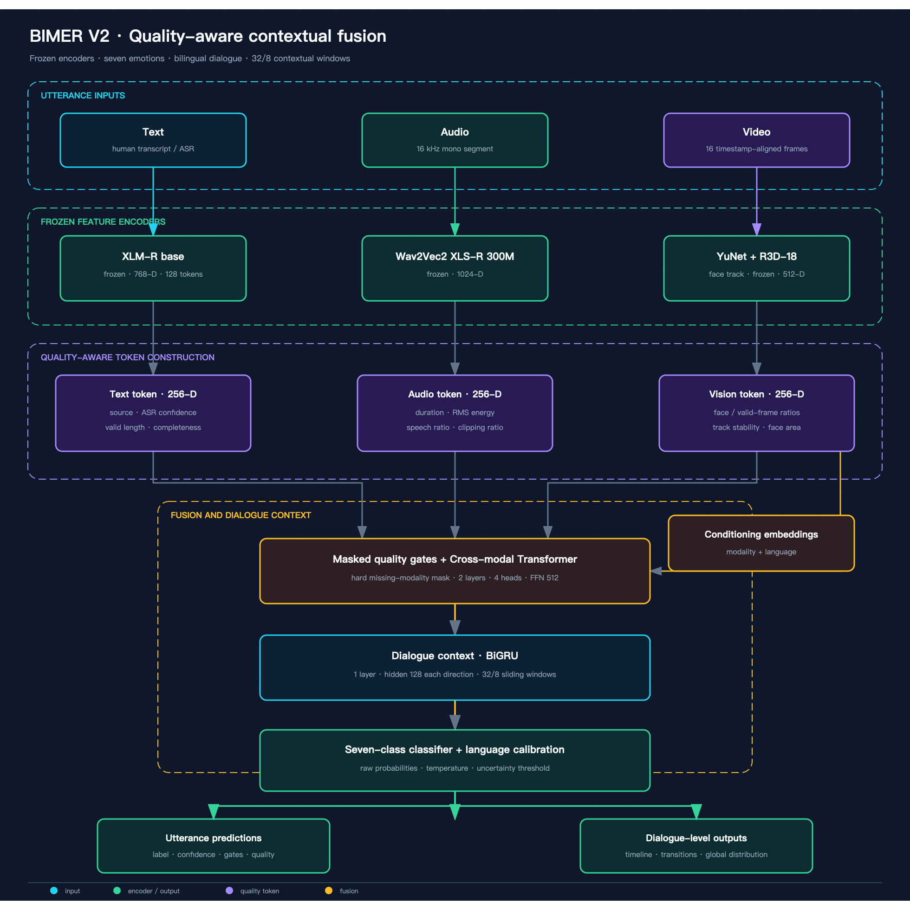
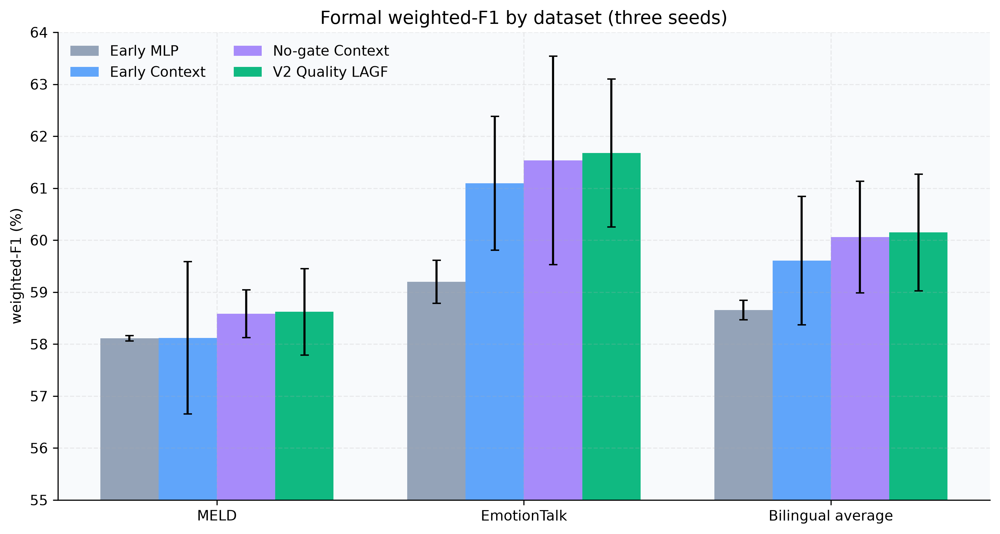
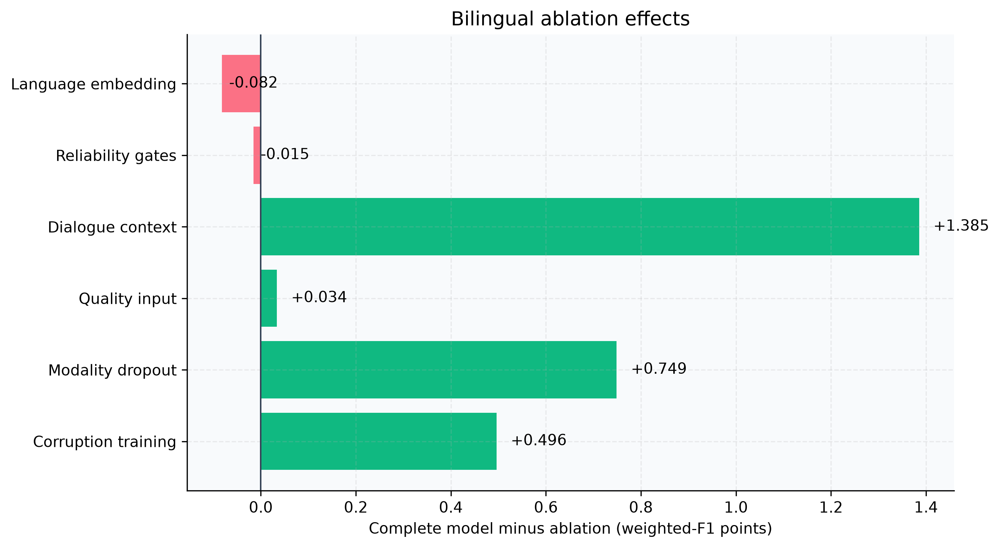
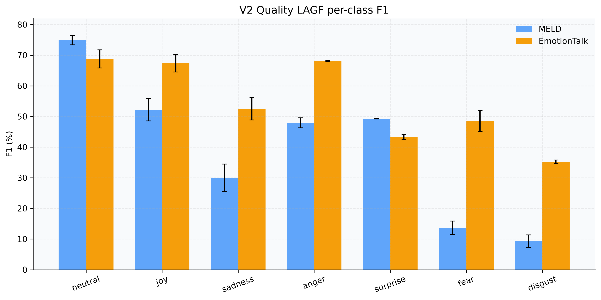
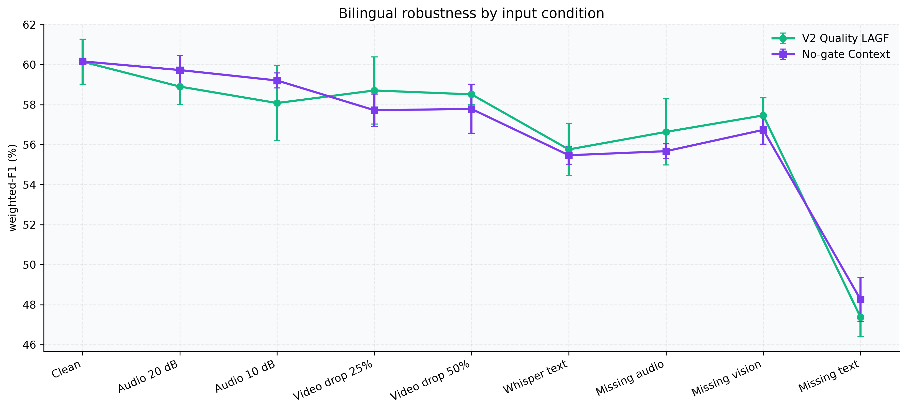

# 基于质量感知与对话上下文建模的中英文多模态情感识别研究与系统实现

本科毕业设计论文内容初稿

作者：周俊杰

完成日期：2026年7月

## 摘要

对话情感识别旨在依据对话中的文本内容、语音韵律和面部行为判断说话者在每个语句时刻的情感状态，是情感计算、人机交互和多模态理解的重要研究问题。现有工作多集中于单一语言或理想数据条件，面对中英文数据分布差异、对话上下文依赖以及人脸缺失、音频噪声、自动转写错误等真实退化时，模型性能和系统可靠性仍存在明显不足。针对上述问题，本文构建了一个统一处理中英文对话视频的七分类多模态情感识别流程，并完成了从数据审计、冻结特征提取、融合模型训练、统计检验到离线演示系统的完整实现。

本文严格保留 MELD 和 EmotionTalk 的官方训练、验证与测试划分，将两套数据统一映射为 neutral、joy、sadness、anger、surprise、fear 和 disgust 七类情感。数据审计覆盖 32,958 条语句及其全部缓存特征。针对 EmotionTalk 原始说话人轨道不能直接代表完整对话的问题，本文引入独立的 context_id，将 19,250 条语句重建为 742 段对话，同时保持 sample_id 不变，从而复用已经提取的特征并避免跨说话人上下文被错误拆分。文本、语音和视频分别使用冻结的 XLM-R、Wav2Vec2 XLS-R 300M 以及 YuNet 与 R3D-18 提取表示，主要训练容量集中于跨模态融合和对话上下文模块。

在模型方面，本文实现质量感知门控融合模型。模型将三种模态投影至统一空间，并为文本、语音和视频分别输入四维质量信息；不可用模态使用硬掩码，低质量模态使用连续质量特征。单句内采用跨模态 Transformer 融合，句间采用双向 GRU 建模最长 32 句的对话上下文。训练流程进一步加入逐维输入归一化、模态随机屏蔽、真实扰动视图训练和中英文均衡采样。为防止结论依赖单次运行，正式实验使用 42、123、2026 三个随机种子，报告样本标准差，并以完整对话为抽样单位进行 2,000 次配对 cluster bootstrap。

实验结果表明，完整模型在 MELD 和 EmotionTalk 上的 weighted-F1 分别为 58.620%±0.830% 和 61.675%±1.423%，双语平均为 60.148%±1.124%。在相同特征和评价口径下，完整模型比 Early MLP 提高 1.493 个百分点，95% 置信区间为 [0.669, 2.200] 个百分点。消融实验显示，对话上下文和模态随机屏蔽分别带来 1.385 和 0.749 个百分点的双语收益，置信区间均不跨零。质量机制相对无门控上下文模型在干净集上的平均优势仅为 0.089 个百分点，不能证明其具有普遍收益；但在 25% 视频丢帧条件下提高 0.986 个百分点，显示出针对视频退化的局部价值。语言嵌入未得到消融支持。进一步的 V3 配对门控排序虽然能够降低受损模态权重，但未达到预先声明的分类性能门槛，因此停止训练并保留为负结果。事后探索性 V4 通过 LoRA 适配文本编码器，在三随机种子验证集上达到 64.556%±0.409% 的双语 weighted-F1 和 54.780%±0.936% 的 macro-F1；但其少数类增益为 1.329 个百分点，未达到预声明的 1.5 个百分点门槛，自适应上下文门和类别原型也未获得消融支持。本文因此未运行 V4 官方测试，正式结论与部署模型仍保持 V2。

系统方面，本文实现固定部署清单、离线资产校验、MPS/CPU 回退、Whisper 子进程隔离、32/8 滑窗推理、转写编辑局部缓存、置信度与质量警告、时间线和 JSON/CSV/PNG 导出。在 MacBook Air M2 8 GB 上，50 秒中文制造业人脸访谈与 31.72 秒英文无人脸视频的冷缓存分析分别耗时 36.51 秒和 30.36 秒；同轮峰值为 3.84 GB，BIMER 进程交换操作为 0，修改文本后的重新分析耗时 5.28 秒。中文 13 段均启用视觉，英文 8 段均自动关闭视觉。由于测试前系统已处于较高的全局换页压力，系统级 swap 完全不变仍需在干净登录环境复验。结果说明，本研究虽未达到单数据集最佳性能，但形成了实验口径可信、创新边界清晰、可离线复现与演示的本科毕设系统。

关键词：多模态情感识别；对话上下文；质量感知；中英文；缺失模态；鲁棒性

## Abstract

Dialogue emotion recognition predicts an utterance-level emotional state from textual content, speech prosody, and facial behavior. Existing systems are often evaluated in a single language and under ideal input conditions, while real applications must handle cross-language distribution shifts, conversational dependencies, missing faces, noisy audio, and automatic-transcription errors. This thesis develops a unified seven-class Chinese-English multimodal emotion-recognition pipeline and implements the complete workflow from data auditing and frozen feature extraction to statistical evaluation and an offline demonstration system.

The official splits of MELD and EmotionTalk are preserved. Their labels are aligned to neutral, joy, sadness, anger, surprise, fear, and disgust. The audit covers 32,958 utterances and all cached feature records. EmotionTalk speaker tracks are reconstructed into 742 complete dialogue contexts through an independent context_id without changing sample_id. Text, audio, and visual representations are extracted with frozen XLM-R, Wav2Vec2 XLS-R 300M, and YuNet plus R3D-18 encoders.

The proposed V2 model combines four-dimensional quality signals for each modality, masked quality gates, a cross-modal Transformer, and a bidirectional GRU over dialogue context. Training uses input normalization, modality dropout, real corrupted views, and balanced bilingual sampling. Formal experiments use three random seeds and 2,000 paired cluster-bootstrap replicates over complete dialogues. The model obtains weighted-F1 scores of 58.620%±0.830% on MELD and 61.675%±1.423% on EmotionTalk, with a bilingual average of 60.148%±1.124%. It improves over Early MLP by 1.493 percentage points, with a 95% confidence interval of [0.669, 2.200]. Ablations support dialogue context and modality dropout. Quality-aware gating shows a targeted benefit under video frame loss but no universal clean-set advantage; language embeddings are not supported. A V3 ranking objective changed corrupted-modality gates in the intended direction but failed the predeclared classification threshold and was stopped as a negative result. A post-hoc V4 study adapted XLM-R with LoRA and reached a three-seed bilingual validation weighted-F1 of 64.556%±0.409% and macro-F1 of 54.780%±0.936%. It nevertheless missed the predeclared minority-class threshold, while adaptive context gating and emotion prototypes were unsupported by ablation. V4 was therefore not evaluated on the official test sets and did not replace V2.

The final system provides an offline deployment manifest, asset verification, MPS/CPU fallback, isolated Whisper transcription, sliding-window inference, partial cache invalidation after transcript editing, uncertainty and quality warnings, an interactive timeline, and JSON/CSV/PNG export. On an 8 GB MacBook Air M2, cold-cache analyses of a 50-second Chinese manufacturing interview and a 31.72-second English no-face video take 36.51 and 30.36 seconds, respectively. The bilingual run has a 3.84 GB peak footprint and zero BIMER-process swap operations; transcript-only reanalysis takes 5.28 seconds. Vision is enabled for all thirteen Chinese segments and disabled for all eight English segments. Because the machine was already under substantial system-wide memory pressure, an unchanged global swap level still requires a clean-login retest. The project does not claim state-of-the-art performance, but provides a reproducible and evidence-bounded bilingual multimodal research system suitable for an undergraduate thesis.

Keywords: multimodal emotion recognition; dialogue context; quality awareness; bilingual learning; missing modalities; robustness

[[TOC]]

# 第1章 绪论

## 1.1 研究背景与意义

情感并非只由词语本身表达。相同文本在不同音调、语速、停顿和面部表情下可能传递截然不同的含义，单句的真实情感还会受到前文事件、说话者关系和情绪惯性的影响。因此，对话情感识别同时涉及语义理解、声学建模、视觉行为分析和序列上下文推理。MELD 将多方对话中的文本、音频和视频统一到语句级标注，为多模态对话情感识别提供了常用英文基准[1]；EmotionTalk 则补充了中文双人交互场景和七类细粒度情感标注[2]。两者共同为中英文统一研究提供了基础，但其采集来源、对话结构、类别分布和媒体质量差异也使联合建模更具挑战。

从应用角度看，稳定的对话情感识别可以为交互式学习、内容检索、服务质量分析和具备情感反馈的人机界面提供辅助信号。然而，情感标签只能近似描述外显表达，模型也无法直接得知人的内在心理状态。本文因此将系统定位为研究与非关键演示工具，并在界面中保留置信度、质量警告和“不确定”状态，不将结果包装成心理或医疗结论。

## 1.2 问题定义

设一段对话由按时间排序的语句序列 D={u1,u2,…,uN} 构成。每个语句具有文本 xt、语音 xa、视频 xv、语言 l、模态可用掩码 m 以及质量向量 q。目标是在保留对话顺序的前提下，为每个语句预测七类情感分布 p(y|xt,xa,xv,l,m,q,D)，并输出最高概率类别、置信度和各模态门控权重。

该问题包含四项核心困难。第一，不同语言和数据集的标签定义、说话风格与类别先验不同。第二，文本、语音和视频的特征尺度及信息密度不一致。第三，语句情感受相邻上下文影响，按单句随机划分会造成泄漏并破坏真实任务。第四，模态可能完全缺失，也可能处于“存在但质量很差”的连续退化状态，仅使用二值掩码不能充分描述这种差异。

## 1.3 国内外研究现状

早期对话情感研究常在单句表示后使用循环网络建模上下文。DialogueRNN 分别跟踪说话者状态、全局对话状态和情感状态，说明参与者与上下文动态是对话情感识别的重要因素[3]。Transformer 通过自注意力直接建模序列内部关系，具有较强的并行性和长距离依赖能力[9]；GRU 通过更新门和重置门控制历史信息保留，在序列任务中以较少参数取得与 LSTM 相近的表现[10]。本文将 Transformer 用于单句内跨模态交互，将 BiGRU 用于句间上下文，分别对应两种不同的结构关系。

预训练表示显著降低了从头训练多模态编码器的成本。XLM-R 在大规模多语言语料上进行自监督训练，为中英文共享文本表示提供基础[4]。wav2vec 2.0 通过在潜在语音空间中进行掩码与对比学习获得自监督声学表示[5]，XLS-R 进一步将跨语言预训练扩展到 128 种语言[6]。视觉方面，三维卷积能够同时编码空间与时间信息，3D ResNet 为视频片段表示提供了可迁移结构[7]；YuNet 面向边缘设备设计轻量、无锚点人脸检测器，适合逐片段的人脸预处理[8]。

现有方法的另一个趋势是从“模态是否存在”扩展到“模态是否可靠”。然而，若门控只从特征自身学习，模型可能把数据集偏差误认为可靠性。例如某一数据集中视觉特征与标签相关性很强，模型可能长期偏向视觉，即使视频被严重丢帧也未必主动降权。本文因此显式构造文本、语音和视频质量向量，并通过真实扰动验证门控是否具有目标性收益。同时，本文不以门控权重看起来合理作为成功标准，而要求分类指标在预先声明的验证门槛上同步改善。

## 1.4 主要工作与贡献

本文的主要工作包括以下四方面。

- 建立 MELD 与 EmotionTalk 的统一七分类流程，严格保留官方划分，并修复 EmotionTalk 说话人轨道被误当作完整对话的问题。
- 设计质量感知跨模态融合与对话上下文模型，在硬缺失掩码之外引入连续质量信号，并采用 32/8 滑窗处理长对话。
- 建立三随机种子、完整对话配对 cluster bootstrap、消融和多种输入退化组成的证据链，明确区分得到支持的贡献、方向性结果和失败结果。
- 实现基于唯一部署清单的离线演示系统，支持自动切句、转写编辑、局部缓存、质量警告、时间线、导出与 M2 性能验收。

本文不将语言嵌入表述为已被证明有效的创新，也不宣称质量门控在所有退化条件下优于无门控模型。这样限制结论范围，能够使论文贡献与实验支持保持一致。

## 1.5 论文结构

第2章介绍多模态情感识别、预训练编码器、融合与上下文建模、鲁棒性和评价方法。第3章说明数据集、标签对齐、上下文重建、预处理与缓存。第4章给出质量感知融合模型和训练协议。第5章分析主结果、消融、逐类性能、鲁棒性以及 V3、V4 探索性结果。第6章介绍系统架构、部署、交互和 M2 验收。第7章总结研究结论、局限与未来工作。

# 第2章 相关技术与研究基础

## 2.1 多模态对话情感识别

多模态情感识别需要处理三种互补关系。文本提供明确语义和情感词，语音提供音高、能量、语速与停顿等副语言信息，视频提供面部动作和姿态变化。互补不意味着每种模态始终同等重要：不同场景、类别和语言的有效模态可能不同，损坏模态甚至会引入反向干扰。因此，融合算法需要同时完成维度对齐、模态交互、缺失处理和上下文建模。

MELD 包含来自电视剧《Friends》的约 13,000 条多方对话语句，并同时提供情感和情感倾向标注[1]。EmotionTalk 包含 19 名演员参与的双人中文对话，提供 23.6 小时、19,250 条语句和七类语句级情感[2]。前者更接近多方影视对话，后者更强调控制场景下的中文交互。将二者直接合并会掩盖分布差异，因此本文以数据集均衡采样和分数据集报告为基本原则。

## 2.2 多语言文本表示

XLM-R 采用 RoBERTa 式掩码语言建模，在 100 种语言的大规模 CommonCrawl 语料上预训练，并在多项跨语言任务上优于多语言 BERT[4]。本文使用 XLM-R base 的冻结输出，通过注意力掩码进行平均池化得到 768 维语句特征。冻结编码器一方面降低训练成本，另一方面保证各融合模型使用完全相同的底层特征，使模型差异更容易归因于融合与上下文结构。

冻结也带来局限。编码器没有针对情感任务和对话语域微调，俚语、讽刺和角色特定表达可能不能被充分编码。本文接受这一折中，将创新集中在统一建模、上下文和鲁棒性，而不是依靠更大编码器追求单数据集最高分。

## 2.3 跨语言语音表示

wav2vec 2.0 先以卷积网络将原始波形编码为潜在序列，再通过 Transformer 上下文网络和掩码对比目标学习表示[5]。XLS-R 将该框架扩展至近 50 万小时、128 种语言的公开语音，形成跨语言声学表示[6]。本文使用冻结的 XLS-R 300M，对 16 kHz 单声道语音进行掩码平均池化，得到 1024 维语音特征。

语音支路的早期实验曾出现全部预测为 neutral 的训练坍缩。线性探针证明特征本身含有判别信息后，本文通过逐维归一化、提高候选学习率、设置最少训练轮数、逐轮洗牌以及记录预测类别分布和梯度范数修复训练链路。这一过程说明，单模态低分不应直接归因于预训练特征，必须先审计优化与采样。

## 2.4 视频时空表示与人脸质量

R3D-18 使用三维卷积残差块编码连续帧中的时空模式，其技术基础来自 3D 卷积和 3D ResNet 对视频表示的研究[7]。本文每句均匀采样 16 帧，先用 YuNet 检测主要人脸，再将裁剪后的视频片段送入冻结 R3D-18 得到 512 维特征。YuNet 面向资源受限设备设计，适合作为轻量人脸检测前端[8]。

视觉模态不以“视频文件存在”作为可用标准。若 16 帧中少于 4 帧检测到人脸，系统将视觉关闭。除此之外，模型还接收人脸检出比例、有效帧比例、轨迹稳定性和人脸面积比例四项连续质量指标，用以区别稳定人脸、快速切镜、远距离人脸和部分丢帧等情况。

## 2.5 融合与上下文建模

Early MLP 将三种模态直接拼接后分类，结构简单，是验证复杂模型是否真正有增益的重要基线。Early Context 在拼接后加入 BiGRU，能够分离“上下文收益”和“复杂门控收益”。无门控上下文模型保留投影、跨模态交互和 BiGRU，但去除可靠性门控，是质量模型必须面对的强基线。

Transformer 的多头自注意力可以学习三种模态 token 之间的关系[9]。BiGRU 则从前向和后向两个方向编码语句序列，使一个语句的表示能够结合相邻情境。系统推理需要长于 32 句的对话，因此本文使用长度 32、重叠 8 的滑窗，并对重叠位置的概率和门控权重求平均，避免只分析前 32 句。

## 2.6 评价指标与统计检验

类别不均衡条件下，accuracy 容易被多数类主导。本文同时报告 weighted-F1、macro-F1、accuracy、每类 F1 和混淆矩阵。weighted-F1 按各类别样本数加权，更接近总体语句表现；macro-F1 对各类等权，能够暴露 fear、disgust 等少数类的不足。

三随机种子结果使用样本标准差，即自由度 ddof=1。模型差异不通过简单比较两个独立置信区间判断，而是对同一批完整对话进行配对 cluster bootstrap：在每个数据集和随机种子内以 context_id 为抽样单位，同时重采样完整模型和比较模型，计算差值后再汇总双语平均。该方法既保持对话内语句相关性，也利用配对设计减少样本波动。

温度缩放通过验证集拟合单一温度参数，在不改变 argmax 类别的前提下校准 softmax 概率，是现代神经网络中常用的后处理方法[12]。系统同时报告 ECE、Brier Score 与 NLL，并仅在 ECE 相对下降至少 10% 且 NLL 不恶化时启用对应语言的温度。

# 第3章 数据集与预处理

## 3.1 数据集划分

本文严格使用官方划分，禁止将语句重新随机分配到训练、验证和测试集。数据审计结果见表 3-1。

| 数据集 | 训练集 | 验证集 | 测试集 | 上下文总数 |
|---|---:|---:|---:|---:|
| MELD | 9,989 | 1,109 | 2,610 | 1,432 |
| EmotionTalk | 15,413 | 1,908 | 1,929 | 742 |
| 合计 | 25,402 | 3,017 | 4,539 | 2,174 |

审计共覆盖 32,958 条语句，sample_id 全部唯一；缓存特征 ID 数同为 32,958，不存在缺失或孤立特征。各划分中 context_id 与 utterance_id 的组合没有重复。

## 3.2 标签统一

MELD 与 EmotionTalk 均能映射到 neutral、joy、sadness、anger、surprise、fear 和 disgust 七类。EmotionTalk 原始 happy 映射为 joy，其余类别保持语义一致。本文不合并少数类，也不把七分类改为情感倾向二分类，因为这样会改变研究问题并使结果无法与官方任务对照。

联合训练集类别频率用于计算平方根倒数类别权重。与直接使用频率倒数相比，平方根能够减弱极少数类权重过大带来的训练不稳定。V3 进一步比较 Balanced Softmax 和 Focal Loss，但只有在 macro-F1 明显提升且 weighted-F1 基本不退化时才允许替换。

## 3.3 EmotionTalk 对话上下文重建

EmotionTalk 媒体与标注中形如 G00006_58_07 和 G00006_58_12 的标识代表同一场景内两个说话人轨道。若直接把完整字符串作为 dialogue_id，734 段双人对话会被拆成两条独立序列，模型无法看到双方语句交替。本文新增 context_id，去除末尾说话人轨道编号，将上述样本统一映射为 G00006_58。

修正后 1,476 条说话人轨道组成 742 段完整对话，其中 734 段为双人对话。原 dialogue_id 与 sample_id 保持不变，因此旧特征可以直接读取，无需重新提取。训练窗口按 context_id 和 utterance_id 排序，禁止窗口跨越对话边界。

## 3.4 文本、语音与视频预处理

训练阶段使用数据集提供的人工文本，最长 128 token。系统推理阶段使用 faster-whisper small 自动检测中英文并生成时间戳；不足 1 秒的片段与相邻片段合并，超过 15 秒的片段按标点和字符比例拆分。完整音频只解码一次，再按时间戳切片，避免每句重复解码。

语音统一转换为 16 kHz 单声道。极短语音在进入特征提取器前补零到安全长度；无法形成有效语音的片段被标记为语音不可用。语音质量向量由时长、RMS 能量、有效语音比例和削波比例组成。

视频按语句时间戳直接抽帧，每句均匀采样 16 帧。人脸质量向量由人脸检出比例、有效帧比例、轨迹稳定性和人脸面积比例组成。无足够人脸时关闭视觉，而不是以零特征冒充正常视频。

## 3.5 特征缓存与完整性

三个冻结编码器在云端离线提取特征，按数据集、划分和模态分片保存为不含 pickle 的 NPZ 文件。缓存键保留 sample_id，特征校验检查维度、有限值、掩码和 ID 集合。EmotionTalk 大规模训练集曾按全局 shard 范围分段提取，每段下载到本地后校验并合并，最终缓存通过完整性与 SHA-256 检查。

系统运行时使用另一套 24 小时、最大 2 GiB 的分阶段缓存。键由视频 SHA-256、时间戳、文本和编码器版本共同决定。只修改文本时复用音频、视频及其质量特征；修改时间戳时对应音视频特征失效。缓存采用原子写入，避免程序中断留下半文件。

# 第4章 质量感知与对话上下文融合模型

## 4.1 总体结构

如图 4-1 所示，模型依次完成冻结特征输入、模态投影与质量 token 构造、质量门控与跨模态 Transformer、BiGRU 对话上下文建模以及七分类与置信度校准。三种编码器全部冻结，减少的训练开销用于三随机种子、消融和鲁棒性实验。

## 4.2 输入归一化与模态投影

训练集上分别拟合文本、语音和视频逐维均值与标准差。归一化统计量写入检查点，验证、测试和系统推理均复用训练统计量，禁止对测试集重新估计。设归一化后的模态特征为 hi，模型通过线性层、激活和归一化将不同维度映射为 256 维 zi。

每个 token 加入模态嵌入和语言嵌入。语言嵌入保留为实现组件，目的是给联合模型提供中英文条件；但消融没有证明其有效，因此论文不将其列为核心贡献。

## 4.3 质量特征与可靠性门控

每种模态拥有四维质量向量 qi。门控网络接收模态投影、质量投影和语言嵌入，经过 256→64→1 的小型网络得到未归一化分数 si。对可用模态进行 masked softmax 后得到权重 αi；不可用模态的权重严格为 0。加权 token 为 αizi，但 Transformer 仍能保留不同模态 token 的身份。

质量门控的设计目标不是让所有样本中的门控均匀，而是在模态退化时降低相应权重。V2 通过真实音频噪声、视频丢帧和 Whisper 文本视图训练；V3 曾增加同一句干净/损坏门控排序损失，要求损坏模态权重至少下降 0.10。该目标成功改变门控方向，但未带来足够分类收益，说明门控可解释性和分类正确性并不等价。

## 4.4 跨模态 Transformer

三个模态 token 输入两层、四头、前馈维度 512 的 Transformer。对第 h 个注意力头，缩放点积注意力表示为：

Attention(Q,K,V)=softmax(QKᵀ/√dk)V。

多头机制允许不同子空间分别建模文本—语音、文本—视频和语音—视频关系。缺失模态在注意力掩码中关闭，任意缺失一种或两种模态时仍至少保留一个有效 token。单元测试覆盖硬缺失、全零质量和任意两模态缺失，要求输出不出现 NaN。

## 4.5 对话上下文 BiGRU

单句融合向量按 context_id 和 utterance_id 排序后输入单层双向 GRU。每个方向隐藏维度 128，拼接后仍为 256 维。训练和推理使用长度 32 的窗口，训练窗口重叠 8 句；系统对长对话的重叠概率和门控求平均。

BiGRU 的作用是捕捉情感惯性、事件响应和相邻语句转折。例如一句表面中性的短回答，若出现在连续愤怒语句之后，其情感解释可能与孤立分类不同。消融结果表明，上下文对 EmotionTalk 的收益显著大于 MELD，是本研究最稳定的模型贡献。

## 4.6 训练目标与采样

主损失为平方根倒数类别权重的交叉熵。联合训练按中英文窗口 1:1 交替采样，单语言与联合采样器均实现 set_epoch()，每轮以 seed+epoch 重新洗牌。早停最少训练 15 轮，之后以两个验证集 weighted-F1 平均值计算耐心 7 轮。

模态随机屏蔽以 0.2 概率只屏蔽一种当前可用模态；仅剩一种模态时不再屏蔽。这样既保持“至少一个模态可用”的约束，也避免独立屏蔽导致同一语句同时丢失多个模态而偏离协议。训练日志记录每轮预测类别分布、梯度范数、门控分布和坍缩标记。

优化器为 AdamW，正式 V2 学习率 1e-4、权重衰减 1e-2、最多 50 轮。结构与超参数只依据验证集冻结，测试集不用于调参。

# 第5章 实验与结果分析

## 5.1 实验设置

所有模型使用相同的官方划分、冻结特征、标签顺序和归一化口径。正式对比包括 Early MLP、Early Context、无门控上下文模型和完整 Quality LAGF。消融依次去除语言嵌入、门控、上下文、质量输入、模态随机屏蔽和扰动视图训练。每个正式模型和消融条件均运行 42、123、2026 三个随机种子。

为确保链路正确，每种模型先在 16 个样本上进行过拟合测试。自动测试还覆盖特征维度、上下文掩码、窗口合并、缺失模态、缓存失效、校准和导出。工程收口后共有 405 项测试通过，总体语句和分支覆盖率为 81.13%。

## 5.2 主结果

| 模型 | MELD weighted-F1 | EmotionTalk weighted-F1 | 双语平均 |
|---|---:|---:|---:|
| Early MLP | 58.113±0.051 | 59.197±0.414 | 58.655±0.189 |
| Early Context | 58.118±1.466 | 61.095±1.286 | 59.607±1.233 |
| 无门控上下文 | 58.582±0.461 | 61.535±2.006 | 60.059±1.071 |
| 完整 Quality LAGF | 58.620±0.830 | 61.675±1.423 | 60.148±1.124 |

完整模型取得四种正式模型中最高的双语平均 weighted-F1。相对 Early MLP 的差值为 1.493 个百分点，完整对话配对 bootstrap 95% CI 为 [0.669,2.200]，得到统计支持。其中 MELD 差值为 0.508 个百分点且区间跨零，EmotionTalk 差值为 2.478 个百分点且区间不跨零，说明总体收益主要来自正确上下文重建后的中文对话。

完整模型相对无门控上下文模型只高 0.089 个百分点，95% CI 为 [-0.603,0.791]。因此，不能使用干净测试集证明质量门控优于强上下文基线。最终部署选择完整模型的依据还包括验证集门槛和视频退化鲁棒性，而非只看干净集均值。

## 5.3 消融实验

| 移除组件 | 消融模型双语 weighted-F1 | 完整模型差值 | 95% CI | 结论 |
|---|---:|---:|---:|---|
| 语言嵌入 | 60.230±0.515 | -0.082 | [-0.756,0.538] | 不支持 |
| 可靠性门控 | 60.163±0.134 | -0.015 | [-0.738,0.669] | 干净集不支持 |
| 对话上下文 | 58.763±0.432 | +1.385 | [0.549,2.157] | 支持 |
| 质量输入 | 60.114±1.197 | +0.034 | [-0.044,0.113] | 总体不支持 |
| 模态随机屏蔽 | 59.399±0.868 | +0.749 | [0.019,1.445] | 支持 |
| 扰动视图训练 | 59.652±2.292 | +0.496 | [-0.213,1.172] | 方向性收益 |

去除上下文带来最大的性能下降，且主要影响 EmotionTalk；这与修复后的双人交互结构一致。去除模态随机屏蔽同样使区间低于零，说明随机缺失训练能提高总体稳健性。扰动训练未达到显著，但将三种子标准差从 2.292 个百分点降到 1.124 个百分点，显示出稳定性信号。

语言嵌入去除后均值略有提高，差值接近零。论文题目因此从早期的“语言感知”调整为“质量感知与对话上下文”，避免把没有证据的模块包装成创新。

## 5.4 逐类性能

完整模型在 MELD 上的 neutral F1 为 74.923%，joy 为 52.204%，但 fear 和 disgust 仅为 13.632% 与 9.272%。EmotionTalk 对应两类达到 48.595% 与 35.194%，整体更均衡。EmotionTalk macro-F1 为 54.830%±0.776%，MELD 为 39.591%±0.488%。

这一结果说明，60%左右的 weighted-F1 不等于七类均衡识别。MELD 中 neutral 样本较多，其较高 F1 会显著影响 weighted-F1。答辩和论文必须同时展示 macro-F1、逐类 F1 与混淆矩阵，不能只用总体数字掩盖少数类短板。

## 5.5 输入退化与缺失模态

| 条件 | 完整模型双语 weighted-F1 | 相对干净集变化 |
|---|---:|---:|
| 干净输入 | 60.148 | — |
| 音频 20 dB | 58.904 | -1.244 |
| 音频 10 dB | 58.080 | -2.068 |
| 视频丢帧 25% | 58.709 | -1.439 |
| 视频丢帧 50% | 58.514 | -1.634 |
| Whisper 文本 | 55.760 | -4.388 |
| 缺失语音 | 56.637 | -3.511 |
| 缺失视频 | 57.463 | -2.685 |
| 缺失文本 | 47.376 | -12.772 |

文本是最关键模态，完全缺失文本使 weighted-F1 下降 12.772 个百分点。Whisper 转写同样造成 4.388 个百分点损失，尤其影响英文 MELD，说明端到端系统性能不仅取决于融合模型，也受 ASR 域差异制约。

在视频丢帧 25% 条件下，完整模型比无门控上下文模型高 0.986 个百分点，95% CI 为 [0.239,1.705]；50% 丢帧时高 0.729 个百分点，但区间略跨零。完整模型在 50% 丢帧下的损失小于完全缺失视觉的损失，满足预设的目标性判据。相反，在音频 10 dB 条件下无门控模型更强，证明质量机制不具有普遍优势。

## 5.6 V3 探索性负结果

V3 先比较类别损失。Balanced Softmax 的双语 macro-F1 只提高 0.154 个百分点，却使 weighted-F1 下降 1.527 个百分点；Focal Loss 使 macro-F1 下降 0.164 个百分点、weighted-F1 下降 0.227 个百分点。两者均未通过预设标准，最终保留 weighted CE。

门控排序筛选比较 λ=0.05、0.10、0.20。三组候选都使受损音频门控平均下降 0.129 至 0.153，受损视频门控下降 0.191 至 0.293，说明损失确实控制了门控方向；但三种扰动的平均 weighted-F1 增益分别只有 0.246、0.334 和 0.126 个百分点，均低于 0.5 个百分点门槛。λ=0.20 还使 10 dB 音频性能下降。

按照预注册协议，没有候选通过时停止 V3，不运行三种子正式训练和官方测试。该负结果提示：门控权重符合直觉不代表分类边界同步改善，额外约束甚至可能把容量用于“解释门控”而不是识别情感。

## 5.7 V4 探索性文本适配与结构负结果

V4 在 V2 确认性实验完成后启动，属于事后探索性研究。第一阶段比较自适应上下文门和跨语言类别原型。最佳的仅上下文门候选相对筛选基线只提高 0.412 个百分点的双语 weighted-F1，同时使 macro-F1 下降 0.805 个百分点、三个目标少数类平均 F1 下降 2.081 个百分点，因此没有通过 seed 42 筛选，类别原型权重也固定为 0。

按照预声明的条件触发规则，第二阶段只对 XLM-R 的 query/value 层进行 LoRA 适配。学习率 `1e-4` 的候选在筛选中同时改善 weighted-F1、macro-F1 和少数类 F1，随后进入三随机种子正式验证。其结果如下。

| 数据集 | weighted-F1 | macro-F1 |
|---|---:|---:|
| MELD | 62.179%±0.834% | 47.369%±1.734% |
| EmotionTalk | 66.932%±0.111% | 62.191%±0.333% |
| 双语平均 | 64.556%±0.409% | 54.780%±0.936% |

相对冻结的筛选基线，V4 的双语 weighted-F1 和 macro-F1 分别提高 2.641 和 2.089 个百分点，两个单数据集也均未退化；但 `fear、disgust、sadness` 平均 F1 只提高 1.329 个百分点，距离预声明的 1.5 个百分点门槛还差 0.171。正式稳定性判定因此为失败。

进一步消融显示，自适应上下文门均值接近 0.99，基本退化为始终使用上下文；去除该门后 weighted-F1 只变化约 0.034 个百分点。原型结构没有通过前期筛选，不能形成有效消融证据。由此可见，V4 的验证集收益主要来自 LoRA 文本域适配，而不是计划中的上下文门或原型创新。本文依照冻结规则停止 V4，不访问官方测试集，不以该结果替换 V2 确认性结果。这个结果同时说明：较高的探索性验证分数不等于新结构假设获得支持。

## 5.8 结果有效性与威胁

内部有效性方面，本文保留官方划分、统一归一化口径并禁止测试集调参；三随机种子和配对 cluster bootstrap 降低了单次运行与对话内相关性带来的误判。构念有效性方面，七类标签仍是对复杂情感的简化，影视表演和演员控制场景也不等于自然交互。

外部有效性仍需通过中英文各 10 段、五类真实条件的视频测试补充。该测试清单必须在运行模型前锁定 SHA-256，由两名标注者独立标注并报告 Cohen’s kappa。当前仅有一段中文正常人脸开放许可样例，尚未补齐其余 19 段授权视频和第二标注者结果，因此本文不填写外部测试数字，也不利用未来外测结果继续调整模型。

# 第6章 系统设计与实现

## 6.1 系统需求与总体架构

系统公开入口保持为 analyze_dialogue(video_path, language="auto")。输入为最长 3 分钟、最大 500 MB 的 MP4 或 MOV，输出包含检测语言、逐句时间、转写文本、情感类别、原始与校准后七类概率、模态可用性、质量向量、门控、置信度状态、情绪转折事件、全局分布和运行阶段耗时。

CLI、Gradio 和验收脚本均通过统一的 deep runtime assembly module 构建模型，不再互相导入私有函数。部署身份由 configs/deployment-v2.json 唯一描述，包括检查点相对路径与哈希、标签顺序、编码器 ID 与 revision、YuNet 哈希、窗口参数、校准参数和结果报告哈希。所有路径相对于 artifact_root，禁止依赖 AutoDL 绝对路径。

## 6.2 离线预检与运行时组装

bimer doctor 在启动前校验部署清单、文件 SHA-256、编码器缓存、FFmpeg、MPS、磁盘空间和离线模式。缺失权重或编码器时直接失败，避免分析到一半才报错。build_runtime 负责设备选择、归一化统计恢复、模型加载、缓存和校准；XLM-R、XLS-R、R3D 与融合模型优先使用 MPS，失败时记录并回退 CPU。

PyAV 与 OpenCV 可能携带不同 FFmpeg 动态库，在同一进程导入时产生警告甚至冲突。本文将 faster-whisper 放入独立子进程，父进程加载 OpenCV/YuNet 而不加载 PyAV。子进程通过 JSON 协议返回转写，设定 600 秒超时，并覆盖无效 JSON、工作进程异常和超时测试。

## 6.3 自动切句与滑窗推理

系统先验证文件格式、大小、时长和有效音轨，再运行 Whisper。短于 1 秒的片段与相邻片段合并，长于 15 秒的中英文片段按标点和字符比例拆分，避免复制同一文本。音频只完整解码一次，视频按时间戳抽帧。

超过 32 句的对话按 32/8 滑窗推理。每个重叠语句可能获得多个窗口预测，系统对概率和门控取平均后重新归一化，再生成统一时间线。全局情感分布使用逐句概率平均，同时保留硬标签直方图。转折事件记录时间、前后情感及置信度。

## 6.4 人工修改与分阶段缓存

转写表格允许用户修改文本并重新分析。缓存键区分视频内容、时间戳、文本和编码器版本，因此只修改文本时不重新计算音频和视频。最终双语 M2 测试中，文本修改后的重新分析总耗时为 5.28 秒，其中文本编码 4.397 秒、缓存音频读取 0.108 秒、缓存视觉读取 0.100 秒、融合 0.057 秒，且不重复运行 Whisper，低于 15 秒验收门槛。

缓存目录最大 2 GiB、有效期 24 小时，写入采用临时文件加原子替换。界面提供清除按钮，真实浏览器测试验证了缓存清理、重新计算和下载行为。

## 6.5 界面与结果导出

Gradio 界面按上传、转写、编辑、分析和导出组织流程。结果摘要显示模型版本、检测语言、语句数、不确定语句数、质量警告和各阶段耗时。逐句表格同时显示标签、置信度、模态可用性和质量提示；时间线支持点击跳转视频；趋势图、模态质量图和全局分布图支持 PNG 导出。

JSON 保留完整机器可读字段，CSV 面向逐句复核，PNG 用于论文和演示。真实 Playwright 测试覆盖上传、转写、单元格编辑、重新分析、时间线跳转、缓存清理和三种导出，浏览器控制台无错误。

## 6.6 M2 实机验收

| 检查项 | 结果 | 门槛 |
|---|---:|---:|
| 中文人脸样例时长 | 50.00 秒 | 30—60 秒 |
| 中文冷缓存完整分析 | 36.51 秒 | 不超过 120 秒 |
| 中文内容与视觉 | 13 段中文，13 段均启用视觉 | 必须 |
| 英文无人脸样例时长 | 31.72 秒 | 30—60 秒 |
| 英文冷缓存完整分析 | 30.36 秒 | 不超过 120 秒 |
| 英文无人脸行为 | 8 段均关闭视觉 | 必须 |
| 双语同轮峰值 | 3.84 GB（3.58 GiB） | 不超过 6.5 GiB |
| BIMER 进程交换操作 | 0 | 0 |
| 文本修改后重分析 | 5.28 秒 | 不超过 15 秒 |
| JSON/CSV/PNG | 真实浏览器下载成功 | 必须 |

错误输入测试验证了文本伪装文件、超过 500 MB 文件和无音轨视频会在分析前给出明确错误。最终中文样例选用美国之音中文网对企业家曹德旺的普通话制造业访谈，从在 Wikimedia Commons 标记为美国之音公有领域作品的 625.158 秒原片截取第 70—120 秒，并固定来源页面及原始、派生文件哈希；页面同时注明该导入文件尚未经过额外的管理员许可复核。验收脚本除时延和资源限制外，还检查中文字符占比与每段视觉可用性，防止仅通过语言参数强制产生假通过。BIMER 进程自身交换操作为 0，但测试前 macOS 已处于较高全局换页压力，系统级 swap 完全不变仍需在干净登录环境复验。

## 6.7 工程质量与复现

项目固定 Python 3.11，以 pyproject.toml 和 uv.lock 作为唯一依赖来源。GitHub Actions 执行全量测试、80% 覆盖率门槛、Ruff、Mypy、pip-audit 和密钥扫描。公开树策略拒绝 artifacts、受限 data、大于 10 MiB 文件和凭证模式。

在干净目录中执行 uv sync --frozen、全量测试和依赖审计均通过。公开仓库只包含代码、配置、测试、聚合结果和文档；数据集媒体、缓存特征、逐样本预测、私人视频、编码器和最终权重保留在带哈希的私有证据包中。

# 第7章 总结与展望

## 7.1 工作总结

本文围绕中英文多模态对话情感识别完成了数据、模型、统计与系统四个层面的工作。数据层面统一 MELD 与 EmotionTalk 七类标签并修复中文上下文分组；模型层面实现质量信号、跨模态 Transformer 和 BiGRU 上下文；实验层面建立三随机种子、配对对话 bootstrap、消融与退化鲁棒性证据；系统层面完成离线部署、自动切句、滑窗、缓存、质量警告、时间线和导出。

正式结果表明，完整模型双语平均 weighted-F1 为 60.148%±1.124%，显著高于 Early MLP。上下文和模态随机屏蔽得到消融支持，质量机制在视频丢帧场景具有针对性收益。语言嵌入、普遍门控收益和 V3 排序监督没有得到支持，本文将其作为局限和负结果报告。V4 的 LoRA 文本适配在验证集上取得明显性能提升，但没有通过全部少数类稳定性门槛；同时，自适应上下文门和类别原型缺少消融支持。因此 V4 只作为探索性分析，不改变 V2 的确认性主结果和系统部署决策。

## 7.2 研究局限

第一，冻结编码器限制了情感语义和声学域适配能力，MELD 的 fear 与 disgust 仍很低；V4 表明文本适配具有潜力，但其证据仅来自验证集。第二，两个数据集的来源差异较大，联合训练不等于跨文化泛化。第三，质量向量只包含四项人工设计统计量，尚不能完整描述遮挡、多人说话和讽刺。第四，系统不实现说话人分离，Whisper 时间戳与数据集人工语句边界存在差异。第五，双语实机验收已完成，但 20 段双人标注外测仍仅完成一段中文正常人脸素材，外部有效性证据尚不充分。第六，V4 上下文门发生饱和且原型未被选中，说明结构复杂度增加并不必然产生可归因的创新收益。

## 7.3 未来工作

未来可在不改变评价口径的前提下探索三方面改进。一是对少数类采用更稳健的表示学习或数据增强，并将轻量文本域适配纳入全新预注册实验，但必须同时观察 macro-F1 和 weighted-F1。二是引入说话人识别或显式参与者状态，扩展当前只按对话序列建模的 BiGRU，并用正则化避免自适应上下文门饱和。三是以更丰富的自监督质量预测替代人工质量向量，并研究“门控可解释性”和“分类收益”之间的关系。

工程上可进一步进行模型量化、编码器按需加载和跨平台打包；研究上应扩大自然场景、口音、年龄与文化覆盖，并由多名标注者报告一致性。任何扩展都应继续保留官方划分、验证集冻结和失败结果公开的原则。

# 参考文献

[1] Poria S, Hazarika D, Majumder N, et al. MELD: A Multimodal Multi-Party Dataset for Emotion Recognition in Conversations. Proceedings of ACL, 2019: 527–536. DOI: 10.18653/v1/P19-1050.

[2] Sun H, Wang X, Zhao J, et al. EmotionTalk: An Interactive Chinese Multimodal Emotion Dataset With Rich Annotations. arXiv:2505.23018, 2025.

[3] Majumder N, Poria S, Hazarika D, et al. DialogueRNN: An Attentive RNN for Emotion Detection in Conversations. Proceedings of AAAI, 2019, 33(01): 6818–6825. DOI: 10.1609/aaai.v33i01.33016818.

[4] Conneau A, Khandelwal K, Goyal N, et al. Unsupervised Cross-lingual Representation Learning at Scale. Proceedings of ACL, 2020.

[5] Baevski A, Zhou Y, Mohamed A, Auli M. wav2vec 2.0: A Framework for Self-Supervised Learning of Speech Representations. Advances in Neural Information Processing Systems, 2020, 33.

[6] Babu A, Wang C, Tjandra A, et al. XLS-R: Self-supervised Cross-lingual Speech Representation Learning at Scale. Proceedings of Interspeech, 2022.

[7] Hara K, Kataoka H, Satoh Y. Learning Spatio-Temporal Features with 3D Residual Networks for Action Recognition. Proceedings of ICCV Workshops, 2017.

[8] Wu W, Peng H, Yu S. YuNet: A Tiny Millisecond-level Face Detector. Machine Intelligence Research, 2023, 20: 656–665. DOI: 10.1007/s11633-023-1423-y.

[9] Vaswani A, Shazeer N, Parmar N, et al. Attention Is All You Need. Advances in Neural Information Processing Systems, 2017, 30.

[10] Chung J, Gulcehre C, Cho K, Bengio Y. Empirical Evaluation of Gated Recurrent Neural Networks on Sequence Modeling. arXiv:1412.3555, 2014.

[11] Radford A, Kim J W, Xu T, et al. Robust Speech Recognition via Large-Scale Weak Supervision. Proceedings of ICML, 2023.

[12] Guo C, Pleiss G, Sun Y, Weinberger K Q. On Calibration of Modern Neural Networks. Proceedings of ICML, 2017: 1321–1330.
